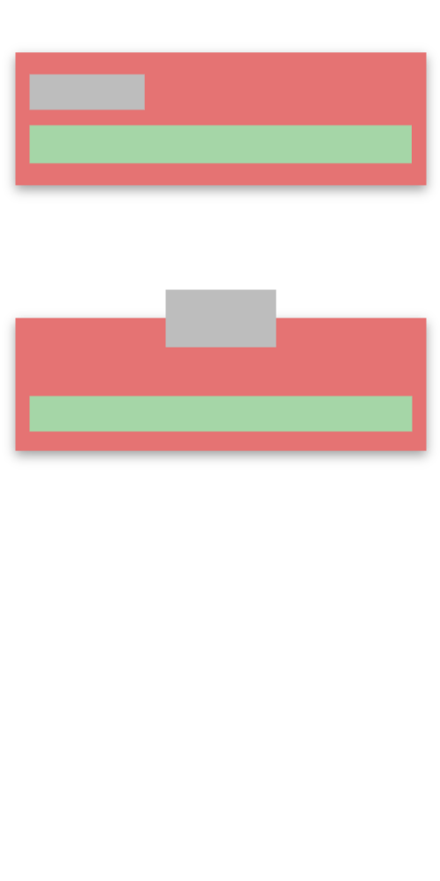
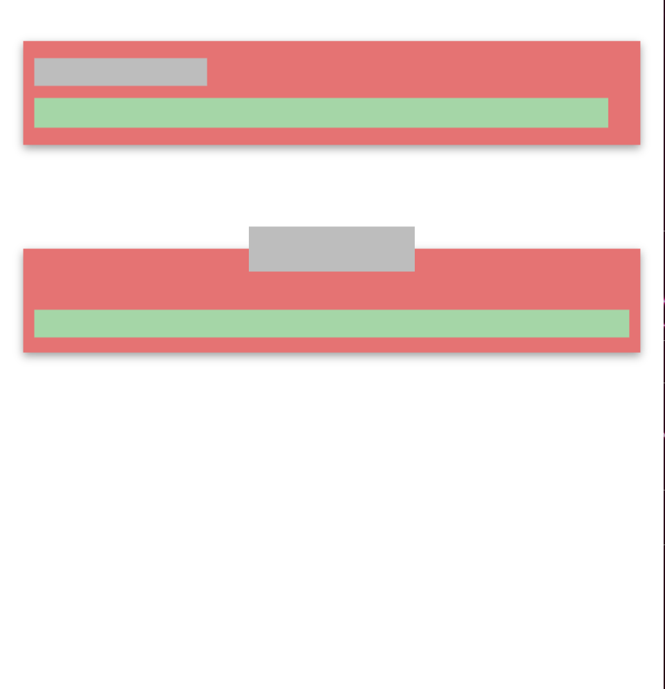

---

# Flutter Responsive Design

Create a Flutter app with responsive components that adapt their sizes based on the screen dimensions. This project aims to demonstrate your understanding of responsive UI development in Flutter.

## Screenshots

  <table>
    <tr>
      <td style="padding-right: 20">
        
      </td>
      <td>
        
      </td>
    </tr>
  </table>

  <table>
    <tr>
      <td>
        
      </td>
    </tr>
  </table>

## Task Description

Objective is to create two different cards on the same screen with the following characteristics:

**Card 1 (Top Card):**
- As the screen size grows or shrinks, the width of the card changes to occupy the same proportion of the screen.
- The green area inside the card also grows to maintain the same proportion of the screen.

**Card 2 (Bottom Card):**
- As the screen size grows or shrinks, the width of the card changes to occupy the same proportion of the screen.
- The green area inside the card also changes its size.
- Despite the changes in the card's size, the grey area within it remains the same size and remains positioned at the top-center of the card.

## Design Details

- The white area represents the screen (mobile, web browser, iPad, etc.).
- The red area represents the card background.

---
